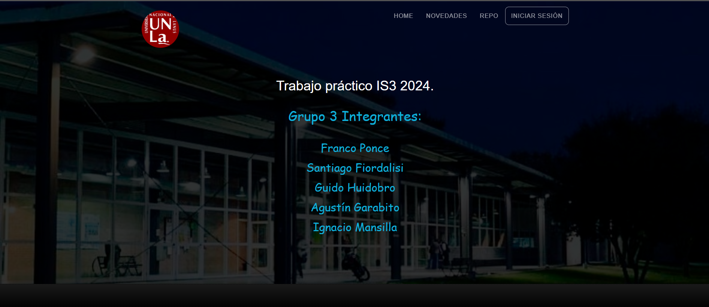
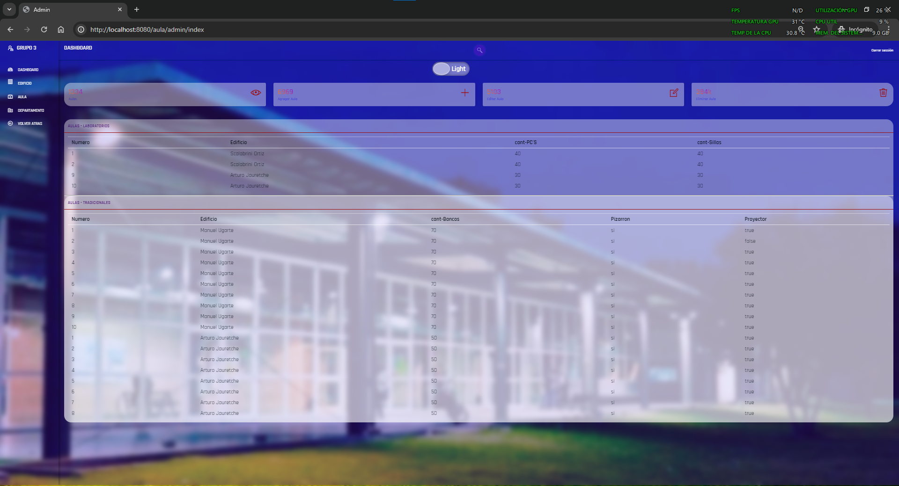
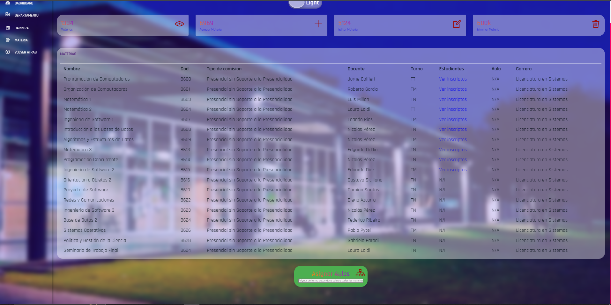
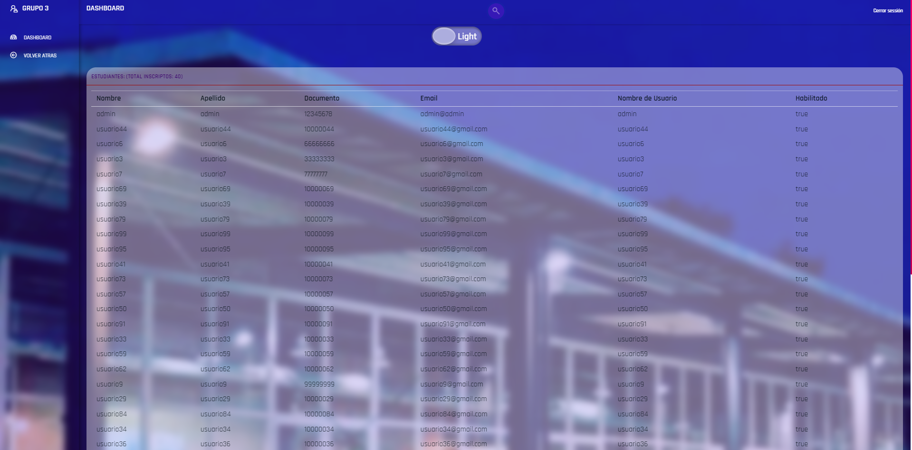
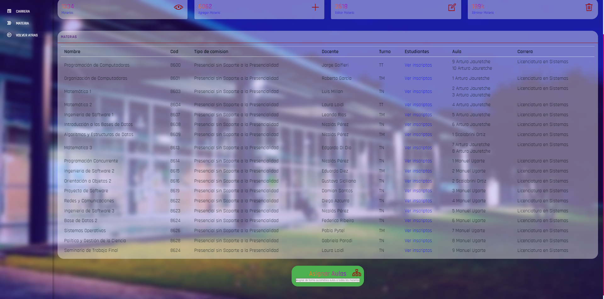
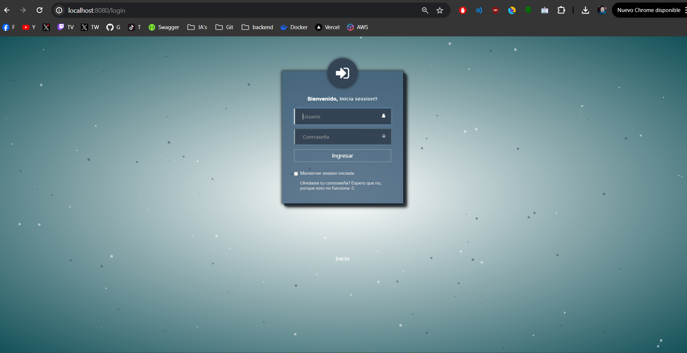
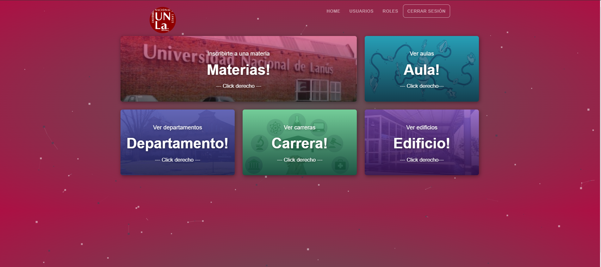

# Grupo 3



## Actividades

- Actividades 1.1.1 #1 #2
- Actividades 1.1.2 #3 #4
- Actividad #13
- Actividades 1.4.1 #14

Actividades que ya estaban resueltas en el proyecto base, algunas que tambien estaban parcialmente completadas y fueron modificadas.

### Ejecución del proyecto

Para compilar y ejecutar este proyecto, seguir estos pasos:

1. **Ejecutar el Script SQL**: Antes de compilar el proyecto, tenes que ejecutar el script SQL que está en la carpeta `script`. Podes ejecutar este script en MySQL Workbench u otra herramienta de gestión de bases de datos. Este script va a crear las tablas necesarias en la base de datos.


2. **Compilar y Ejecutar el Proyecto con Spring Maven**: Usá Spring Maven para compilar y ejecutar el proyecto. Desde la línea de comandos, navega hasta el directorio raíz del proyecto y ejecuta el siguiente comando:

    ```
    mvn spring-boot:run
    ```
### Credenciales de Prueba

- **Administrador**: 
  - Usuario: admin
  - Contraseña: admin123

- **Usuarios Genéricos - X es incremental por usuario**:
  - Usuario: usuarioX
  - Contraseña: usuario


---
## Vista de Administrador: Aulas



## Vista de Administrador: Materias

En esta instancia, se inscribieron algunos estudiantes en algunas materias para probar la asignación de aulas.

- Para la entrega final, se abordarán algunos problemas de asignación, como:
  - La posibilidad de asignar más de un aula a una materia en caso de que tenga una gran cantidad de estudiantes y no haya suficientes aulas disponibles para esa capacidad.
  - En la segunda entrega se resolverá este problema.

En la imagen, algunas materias no tienen inscritos debido a que es solo una prueba. Además, en el campo "AULA" aparece "N/A" (No Asignada). Una vez que un administrador presione el botón de asignación de aulas, estas se asignarán automáticamente.



## Vista de Administrador: Estudiantes Inscritos en una Materia



## Vista de Administrador: Asignacion de Aulas automatica a Materia



## Login



## Estudiante - Vista Index Parcial


