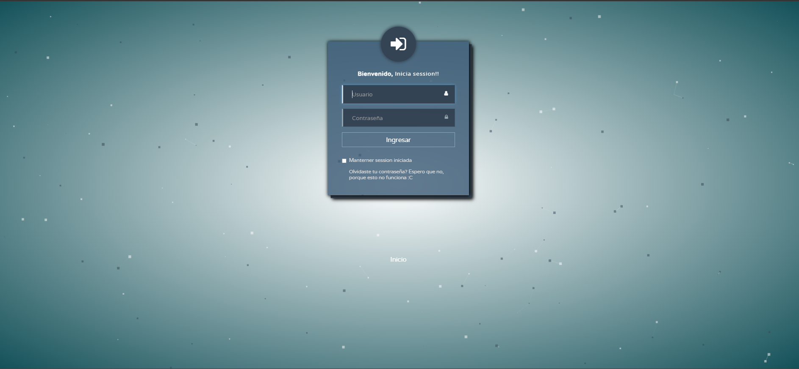

# Grupo 3
En este readme se presenta un breve resumen de la funcionalidad del sistema para la primera entrega.

## Índice

1. [Actividades](#actividades)
2. [Ejecución del proyecto](#ejecución-del-proyecto)
3. [Credenciales de Prueba](#credenciales-de-prueba)
4. [Vista de Administrador: Aulas](#vista-de-administrador-aulas)
5. [Vista de Administrador: Materias](#vista-de-administrador-materias)
6. [Vista de Administrador: Estudiantes Inscritos en una Materia](#vista-de-administrador-estudiantes-inscritos-en-una-materia)
7. [Vista de Administrador: Asignación de Aulas Automática a Materia](#vista-de-administrador-asignacion-de-aulas-automatica-a-materia)
8. [Login](#login)
9. [Estudiante - Vista Index Parcial](#estudiante---vista-index-parcial)


## Actividades

- Actividades 1.1.1 #1 #2
- Actividades 1.1.2 #3 #4
- Actividad #13
- Actividades 1.4.1 #14

Actividades que ya estaban resueltas en el proyecto base, algunas que tambien estaban parcialmente completadas y fueron modificadas.

### Ejecución del proyecto

Para compilar y ejecutar este proyecto, seguir estos pasos:

1. **Ejecutar el Script SQL**: Antes de compilar el proyecto, tenes que ejecutar el script SQL que está en la carpeta `script`. Podes ejecutar este script en MySQL Workbench u otra herramienta de gestión de bases de datos. Este script va a crear las tablas necesarias en la base de datos.


2. **Compilar y Ejecutar el Proyecto con Spring Maven**: Usá Spring Maven para compilar y ejecutar el proyecto. Desde la línea de comandos, navega hasta el directorio raíz del proyecto y ejecuta el siguiente comando:

    ```
    mvn spring-boot:run
    ```
### Credenciales de Prueba

- **Administrador**: 
  - Usuario: admin
  - Contraseña: admin123

- **Usuarios Genéricos - X es incremental por usuario**:
  - Usuario: usuarioX
  - Contraseña: usuario


---
## Vista de Administrador: Aulas

En esta vista, se pueden gestionar y visualizar información sobre las aulas disponibles. La capacidad de cada aula está determinada por:

1. **Tradicional**: Por la cantidad de bancos disponibles.
2. **Laboratorio**: Por la cantidad de (PCs) disponibles.

Además, las aulas fueron creadas en base a las aulas reales disponibles en los distintos edificios de la UNLa.


## Vista de Administrador: Materias

En esta instancia, se inscribieron 1.000 estudiantes repartidos entre las materias para probar la asignación de aulas.

En la imagen, se listan las materias. Además, en el campo "AULA" aparece "N/A" (No Asignada). Una vez que un administrador presione el botón de asignación de aulas, estas se asignarán automáticamente.


## Vista de Administrador: Estudiantes Inscritos en una Materia

En esta vista se listan todos los usuarios inscritos a la materia ```Programación de computadoras``` 


## Vista de Administrador: Asignacion de Aulas automatica a Materia

En esta vista de administrador, después de hacer clic en el botón `Asignar Aulas`, se ejecuta el algoritmo de asignación. Este algoritmo funciona internamente realizando las siguientes acciones:

1. Obtiene todas las aulas y materias disponibles.
2. Recorre las materias para verificar si ya tienen aulas asignadas.
3. En caso de no tener aulas asignadas, verifica si la materia necesita un aula tradicional o un laboratorio.
4. Dependiendo del tipo de aula requerida, utiliza el método correspondiente de la instancia para determinar la capacidad necesaria.
5. Ordena las aulas disponibles según su capacidad.
6. Recorre las aulas disponibles, verificando que no estén ocupadas y que cuenten con el espacio suficiente para la cantidad de estudiantes requeridos.

> **Nota:** En la imagen se muestra el resultado de la asignación, donde se puede observar que algunas materias tienen asignadas dos aulas. Esto se debe a las capacidades limitadas tanto de aulas como de materias. Por ejemplo, si una materia cuenta con 100 estudiantes y el aula más grande tiene capacidad para 70 personas en aulas tradicionales o 40-30 en laboratorios, hemos decidido asignar un aula adicional a esa materia (o las aulas que sean necesarias, NO se limita solo a una más).

El código del algoritmo de asignación se encuentra en `src/main/java/com/services/impl/MateriaService.java`.


## Login



## Estudiante - Vista Index Parcial


